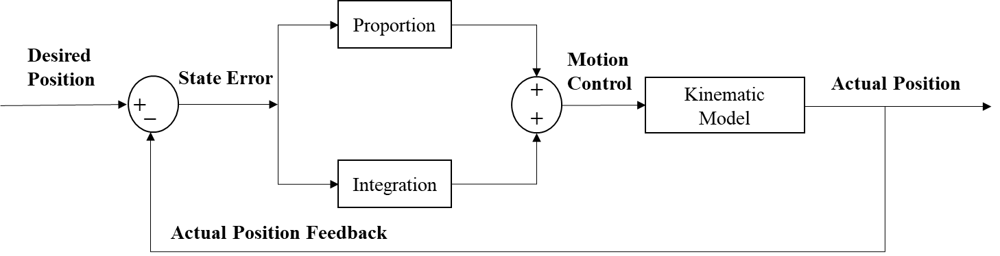
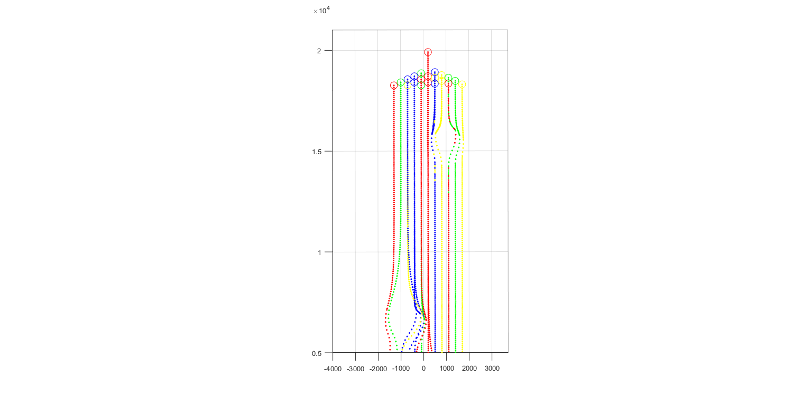

# UAV_swarm_3d_simulation

## **Abstract**

Unmanned aerial vehicle (UAV), as an automatic flying machine with superior performance and many functions, has been widely used in various fields. UAV swarms can make up for the lack of performance when a single UAV performs tasks and improve maneuverability. Aiming at the safety problem of UAVs during the formation process of UAV swarm, a new obstacle/collision avoidance method based on the improved artificial potential functions is designed and implemented. Considering collision avoidance between different UAVs and static obstacles, the artificial potential
functions were improved by adding the emergency collision avoidance repulsive force. In simulations, an automatic control system with Inner and outer feedback loops was applied to connect the obstacle/collision avoidance method with the Leader-Follower formation tracking control module, which realizes the functions of preventing UAV swarm conflicts and avoiding obstacles. The simulations of UAV swarms for collision and static obstacles avoidance in the three-dimensional environment were performed in MATLAB.

In the simulations, the UAV swarm consisting of 21 UAVs encountered two static obstacles during the formation flight. The coordinates of the axis of the two obstacles in the plane are (-1000m, 6500m), (1000m, 15500m), and the radius is 800m and 500m, respectively. The UAV swarm moves in a straight line, and the formation shape is a triangle. It can be seen that during the flight of the UAV swarm, both obstacles were successfully avoided, and no UAV hit the obstacle. In addition, there was no obstacle avoidance between the UAVs, which realize the obstacle/collision avoidance.

The figure below records the shortest distance between the UAVs in the swarm during the entire flight. It can be seen that UAVs in the swarm did not collide, but a certain height difference was generated at the moment of collision, and collision avoidance was completed.

